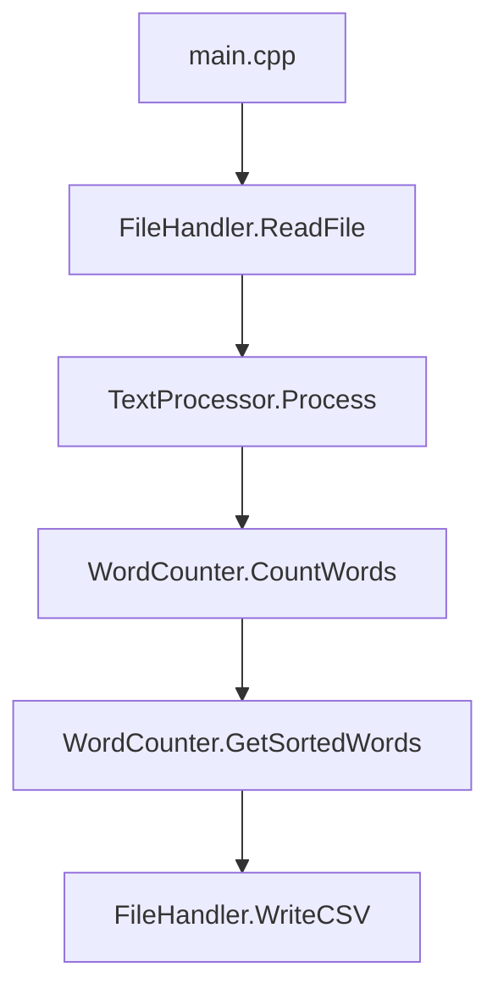

# Документация к проекту "Word Frequency Analyzer"


## 🎯 Общее описание

**Word Frequency Analyzer** - программа для анализа текстовых файлов. Она подсчитывает частоту встречаемости слов и генерирует отчет в CSV формате.

### Основные функции:
- Чтение текстового файла
- Очистка текста от пунктуации
- Подсчет частоты слов
- Сортировка по убыванию частоты
- Генерация CSV отчета с процентами

## 📁 Структура проекта

```
lab0/
├── include/                # Заголовочные файлы
│   ├── text_processor.h    # Обработчик текста
│   ├── word_counter.h      # Счетчик слов
│   └── file_handler.h      # Работа с файлами
├── src/                    # Исходные файлы
│   ├── main.cpp            # Точка входа
│   ├── text_processor.cpp
│   ├── word_counter.cpp
│   └── file_handler.cpp
└── CMakeLists.txt          # Конфигурация сборки
```

##  Взаимодействие компонентов

### Последовательность выполнения:



## 🛠️ Сборка и запуск

### Сборка с CMake:
```bash
mkdir build
cd build
cmake ..
make
```

### Ручная компиляция:
```bash
g++ -Iinclude src/*.cpp -o word_analyzer
```

### Запуск:
```bash
./word_analyzer input.txt output.csv
```

## 📊 Форматы данных

### Входные данные:
- **Формат:** Произвольный текстовый файл
- **Кодировка:** UTF-8


### Выходные данные:
- **Формат:** CSV с разделителем ';'
- **Кодировка:** UTF-8


## ⚠️ Обработка ошибок

Программа обрабатывает следующие ошибки:
- Неверное количество аргументов командной строки
- Невозможность открыть входной файл
- Невозможность создать выходной файл
- Исключения при обработке текста

## 🔧 Особенности реализации

### Алгоритм обработки текста:
1. **Глобальная очистка:** Все знаки пунктуации заменяются на пробелы
2. **Нормализация:** Текст приводится к нижнему регистру
3. **Токенизация:** Текст разбивается на слова по пробелам
4. **Локальная очистка:** Удаление пунктуации с краев каждого слова


